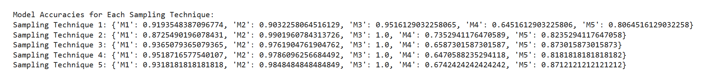

### Introduction
Sampling is a statistical technique used to select a subset of data from a larger dataset. This approach helps reduce computational overhead while maintaining the representativeness of the data.

### Steps Followed

#### Step 1: Dataset Preparation
Credit card dataset downloaded from a GitHub URL.

#### Step 2: Balancing the Dataset

The dataset was imbalanced, with unequal distribution of target classes.

Used SMOTE (Synthetic Minority Oversampling Technique) to balance the dataset by generating synthetic examples for the minority class.

#### Step 3: Sample Size Calculation

Applied the sample size detection formula for a 95% confidence level:

Where:

Z: Z-score (1.96 for 95% confidence level).

p: Proportion (assumed to be 0.5 if unknown).

e: Margin of error (varied from 0.05 to 0.01).

Adjusted sample sizes for a finite population using:

Where N is the population size.

#### Step 4: Sampling Techniques

Five sampling techniques were implemented:

#### Random Sampling: Randomly selected samples from the balanced dataset.

#### Systematic Sampling: Selected samples at regular intervals.

#### Stratified Sampling: Ensured proportional representation of target classes in the samples.

#### Cluster Sampling: Divided data into clusters based on the target variable and sampled within clusters.

#### Bootstrap Sampling: Used resampling with replacement to create new datasets.

#### Models Used

#### Logistic Regression: A linear model for binary classification problems.

#### Decision Tree: A tree-based model that splits data based on features.

#### Random Forest: An ensemble model that combines multiple decision trees.

#### Support Vector Machine (SVM): Finds the hyperplane that best separates classes.

#### K-Nearest Neighbors (KNN): Classifies data points based on their nearest neighbors.

### Result

Maximum accuracy for each model is given by following sampling methods:
#### M1: Sampling 4
#### M2: Sampling 2
#### M3: Sampling 2,3,4,5
#### M4: Sampling 2
#### M5: Sampling 3

